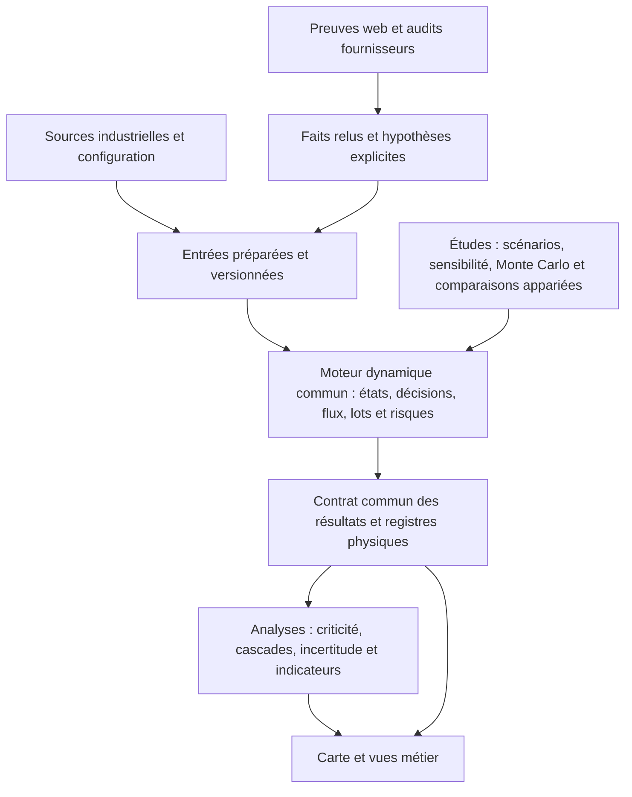

# Simplifier Etudecas sans perdre le modèle ni les analyses

Diagnostic initial du 22 septembre 2026, fondé sur le commit `7e0f46504` et les fichiers
locaux **avant rangement**. Les chiffres ci-dessous décrivent cet état initial.
Cette première revue ne modifiait ni le modèle ni les résultats. Le rangement et les
vérifications réalisés ensuite sont suivis dans
[REGENERER_RESULTATS.md](REGENERER_RESULTATS.md) : quatre HTML conservés, retrait des
anciens calculs détaillés, reconstruction des présentations et vérification du recalcul.
Les changements d'architecture proposés plus bas restent un plan distinct.

## 1. Diagnostic

Le projet contient un socle utile, mais mélange quatre choses : le logiciel courant,
les méthodes de recherche, les résultats de calcul et les preuves/historiques de développement.
La simplification doit réduire les points d'entrée et les dépendances aux chemins historiques.
Déplacer des fichiers puis conserver des dizaines de jonctions ne résout pas ce problème.

Inventaire physique d'`etudecas`, sans parcourir les 39 jonctions :

| Ensemble | Fichiers | Volume décimal |
| --- | ---: | ---: |
| Ensemble local `etudecas` | 14 100 | 44,64 Go |
| Résultats de simulation, archives comprises | 10 453 | 42,995 Go |
| Référence actuelle, avec risques et sensibilités | 193 | 8,655 Go |
| Référence historique retenue avec Monte Carlo | 1 047 | 0,807 Go |
| Autres résultats dans `simulation/result/archive` | 9 210 | 33,532 Go |
| Preuves et essais sous `artifacts/testing` | 1 381 | 1,539 Go |

Les lignes sont incluses les unes dans les autres et ne s'additionnent pas.
Déplacer 33,5 Go hors du logiciel allège l'arborescence, pas l'espace disque utilisé.
La compression ou le retrait de données redondantes est une décision distincte.
Plusieurs registres `lot_causal_links.csv` dépassent 2 Go : même une livraison récente
reste volumineuse. Il faut donc aussi maîtriser ce que produiront les prochains calculs.

Pour les fichiers suivis par Git dans `etudecas` et le pack : 1 654 fichiers,
717 fichiers Python et 496 158 lignes Python, tests compris. Les prototypes d'Etudecas
représentent 336 fichiers Python, dont 147 fichiers `test_*`, et 316 638 lignes.
Ce volume ne signifie pas que ces fonctions sont toutes inutiles ou indépendantes.
Le pipeline principal déclare 14 sous-commandes et 89 appels à `add_argument`.

Trois gros fichiers concentrent beaucoup de responsabilités : le moteur actif
(17 522 lignes), le template HTML (15 931) et le constructeur de carte (12 633).
Le moteur pilote distinct compte aussi 15 632 lignes.

## 2. L'essence à conserver

| Fonction | Réalité du code examiné | Simplification proposée |
| --- | --- | --- |
| Simulation de base | Un moteur principal de stocks et flux à pas journalier, avec délais, commandes et encours. | Une seule API d'exécution et une définition explicite de l'état et des phases. |
| Lotification et traçabilité | Politique de lots, exécution physique, généalogie et rapprochements explicatifs sont distincts. | Garder ces contrats et les deux suivis de lots ; une source physique commune pour les vues. |
| Dépendance à l'état | Décisions et risques dépendent de la couverture, saturation, mémoire et autres états observés. | En faire une propriété explicite du moteur et des scénarios, pas un moteur copié. |
| Cascades de risques | Propagation physique dans le moteur ; graphes d'exposition/causalité reconstruits en aval. | Distinguer incident, exposition et conséquence incrémentale, avec un scénario témoin pour cette dernière. |
| Sensibilité | Études paramétriques et campagnes fournisseurs existent. | Une famille d'études accessible par configuration, sans script spécifique à chaque campagne. |
| Criticité fournisseur | Calcul local commun déjà extrait ; classements et diagnostics plus spécialisés subsistent. | Déclarer les différentes questions et formules ; conserver un calcul canonique par indicateur. |
| Contexte fournisseur web | Collecte surtout dans `POC2026`, consommation de registres préparés dans Etudecas. | Un contrat d'échange explicite, avec identité, URL, date, statut et hypothèse retenue. |
| Audit fournisseur | Questionnaires Excel et estimations/proxies sont distingués. | Séparer lecture des sources, calcul et affichage ; préserver cette distinction métier. |
| Monte Carlo et propagation | Tirages, KPI, trajectoires, diagnostics de variance et expériences appariées/temporelles existent. | Une famille d'études d'incertitude qui partage l'exécution, mais conserve ses méthodes et hypothèses. |

### Le modèle dynamique reste le centre

Le moteur actif est [run_first_simulation.py](../simulation/engine/run_first_simulation.py),
appelé par le pipeline. Sa boucle journalière commence à la ligne 9476.
Les stocks, commandes en attente, encours, lissages et mémoires de risque persistent
d'un jour à l'autre. La production consomme des composants et libère les lots selon
leurs règles d'exécution. Les observations du jour peuvent déclencher des effets à J+1.

La cible conserve la dynamique des systèmes : stocks, flux, retards et rétroactions.
Les règles discrètes de lots, calendriers et événements restent articulées à cette dynamique.
La simplification ne demande ni un nouveau solveur, ni un changement du pas temporel.
L'ordre actuel des phases, les arrondis et l'état aléatoire doivent rester identiques
lors d'une extraction de code.

Les contrôleurs `control_provider_v2.py` et `control_provider_v3.py` héritent des versions
précédentes. Leur suffixe ne suffit donc pas à les classer comme doublons.
Le graphe actif sous `simulation_prep/result/reference_baseline/_mrp_bom_tests` est
également une vraie dépendance, malgré son nom.

### Les incertitudes doivent rester interprétables

Distinguer quatre questions :

1. Sensibilité : que devient la sortie lorsqu'un paramètre change ?
2. Incertitude sur les paramètres : quelles sorties produit une distribution d'entrées donnée ?
3. Aléas et dépendance à l'état : quels événements surviennent sur une trajectoire donnée ?
4. Attribution : quelle différence observe-t-on entre deux expériences comparables ?

Le wrapper [run_robust_montecarlo.py](../simulation/montecarlo/run_robust_montecarlo.py)
sélectionne un profil qui fait varier les indicateurs (notamment lignes 199–299).
C'est utile pour explorer des tensions et seuils. Cela ne calibre pas automatiquement
les probabilités sur des observations industrielles. Conserver cette méthode sous
un libellé explicite d'exploration/stress, distinct d'une propagation sous distributions
d'entrée justifiées par les données.

Les [expériences appariées](../simulation/uncertainty/paired_propagation.py) et temporelles
doivent rester disponibles. Les corrélations et ajustements statistiques des sorties
ne remplacent pas une comparaison contrôlée pour attribuer un effet.
Documenter les dépendances entre entrées réellement modélisées et les hypothèses
d'indépendance ; ne pas confondre corrélations des résultats et dépendances des tirages.

Le générateur Monte Carlo examiné ne réalise pas une campagne imbriquée systématique
« un tirage de paramètres × plusieurs graines d'événements ». Cette séparation des
sources d'incertitude serait une extension scientifique, à traiter après le rangement.
La décomposition actuelle est prédictive, par régression Ridge et permutations groupées,
pas une analyse Sobol. Aucune covariance/copule ajustée aux données n'a été trouvée
dans le générateur canonique examiné ; facteurs communs et familles de stress peuvent
néanmoins créer des dépendances entre perturbations.

Conserver également la distinction entre criticité structurelle, indicateurs fournisseur
hebdomadaires et audit observé/estimé. Leur réunion dans une fiche fournisseur ne doit
pas produire un score unique qui efface le sens de ces trois dimensions.

## 3. Architecture cible : un moteur, des méthodes autour

Ce sont des responsabilités à rendre claires, pas neuf nouveaux programmes à créer.
Conserver d'abord les modules canoniques actuels et leur API ; les renommages physiques
viennent après la migration des dépendances.

Les repères visibles à terme peuvent rester proches des noms existants :

- `data/` et `config/` : sources, preuves fournisseur, hypothèses et entrées préparées ;
- `simulation/` : moteur commun, lots/logistique, méthodes d'études et contrat des résultats ;
- `risk/` : modèles de risque, criticité et audits/contexte fournisseur ;
- `visualization/` : lecture des résultats et interface ;
- un seul emplacement de résultats actifs, avec une livraison désignée explicitement ;
- `docs/` : manuel courant et règles documentées ;
- outillage de tests, documentation et agents, accessible aux développeurs.

Recherche historique et anciens calculs sont conservés à part de cet arbre actif.
L'outillage natif `.agents/`, `.codex/` et `toolbox/` reste utile. Le mini-kit du pack
est une démonstration séparée ; ses fixtures encore utilisées doivent être reprises
avant de sortir le pack de l'arbre de développement courant.

## 4. Plan proposé, dans l'ordre

| Priorité | Travail concret | Critère de fin |
| --- | --- | --- |
| 1. Rendre les références et les fichiers transportables | Unifier la désignation de la livraison courante à partir des contrats existants. Référencer nominal, risques, sensibilités, MC et preuves compatibles. Remplacer les chemins historiques dans les lecteurs, puis retirer les 37 jonctions à la racine de `result`. | Lecture, carte, tests et commandes fonctionnent avec les anciens chemins absents. Une campagne nouvelle n'écrit pas dans l'archive. |
| 2. Réduire l'arbre actif et maîtriser les sorties | Sortir les anciennes simulations et études ponctuelles de l'arbre courant ; conserver leurs identifiants, entrées et preuves. Distinguer exports de synthèse, diagnostic de lots et debug. | Inventaire avant/après sans perte, archives relisibles, une politique de conservation appliquée aux nouveaux calculs. |
| 3. Réunir les chemins d'exécution | Faire converger CLI, API et campagnes vers `engine/api.py`. Mutualiser lancement, reprise, provenance et collecte ; laisser scénarios, échantillonnage et agrégation à chaque méthode. | Même requête résolue, mêmes options et mêmes résultats par chaque entrée. Cinq opérations utilisateur suffisent : préparer, simuler, étudier, explorer, vérifier. |
| 4. Consolider recherche et contrôles | Classer chaque famille en méthode active, recherche à conserver ou historique. Extraire les fonctions utiles des scripts de campagne. Promouvoir les oracles réutilisables actuellement dans `artifacts` avec leurs fixtures/données requises. | Les fonctions essentielles et leurs contrôles sont reproductibles depuis les sources versionnées, sans script local oublié. |
| 5. Découper progressivement les gros modules | Extraire préparation, planification, état/exécution, risques/contrôles et exports du moteur. Séparer calcul des indicateurs, payload et rendu HTML. | Équivalence quotidienne et des registres sur cas représentatifs ; chaque extraction constitue un changement indépendant et réversible. |
| 6. Simplifier le parcours métier et la documentation | Organiser l'accueil autour de réseau/production, lots/transports, risques/incertitude et fournisseurs. Une page de référence par fonction, règles générées conservées, bilans datés dans l'historique. | Scénario et période restent visibles ; chaque résultat indique origine et hypothèses ; accès aux détails existants préservé. |

Les priorités 1 et 2 apportent la simplification visible sans toucher aux équations.
Les priorités 3 à 5 diminuent le coût de maintenance. La priorité 6 réduit l'effort
nécessaire pour comprendre et utiliser les résultats. Aucun nouveau framework
d'orchestration n'est nécessaire pour commencer.

### Précisions de migration

- Le fichier [reference/current.json](reference/current.json) désigne encore le calcul
  du 18 septembre, alors que l'accueil recommande le 20 septembre. Préserver cette
  référence figée sous son identité historique ; ne pas remplacer silencieusement ses preuves.
- Une livraison courante est un ensemble compatible. Le Monte Carlo de juillet
  ne doit pas compléter silencieusement le nominal de septembre : l'absence d'une analyse
  doit rester explicite. Relancer une campagne relève ensuite d'un travail scientifique distinct.
- Les anciens manifestes sont conservés à l'identique. Un index de relocalisation ou
  un nouveau manifeste portable doit les référencer, sans modifier leurs signatures historiques.
- Une archive autonome comprend les entrées nécessaires. Le commit sauvegarde le code,
  pas les 43 Go de résultats locaux ignorés par Git.
- Pour Monte Carlo, conserver les configurations, paramètres tirés, graines, statuts,
  KPI individuels et trajectoires nécessaires ; le détail complet des lots peut être réservé
  à des réalisations choisies et reproductibles. Le registre complet d'une livraison de lots
  doit rester disponible pour ses enquêtes.
- Compresser ou changer le format d'un registre de plusieurs Go demande un lecteur compatible
  et un rapprochement intégral. Ce n'est pas une simple suppression de fichier.
- La collecte [POC2026](../../POC2026/supply_geo_case/tools/enrich_supplier_context.py)
  conserve des preuves candidates inactives. Le mapping fournisseur/site/preuve/signal/hypothèse
  est à expliciter avant toute intégration. Les questionnaires réels restent distincts des proxies.
- Le moteur pilote, les campagnes `v2`/`v4`, les anciens constructeurs de référence et les
  wrappers sont seulement des candidats au tri, après contrôle des imports, commandes,
  configurations et résultats qui en dépendent.
- SCAN comprend un modèle réduit, des replays de commandes et des expériences en boucle
  fermée sur le moteur canonique. Leur registre doit préciser modèle et protocole.
  Certaines campagnes V8 réutilisent V4 via V7 : conserver la chaîne nécessaire avant
  d'archiver des versions, et ne pas renouveler automatiquement leurs signatures de contrôle.

## 5. Vérifier la simplification

Pas de réécriture globale suivie d'un seul contrôle final. Pour chaque étape :

1. Enregistrer les entrées, options résolues, versions et graines du cas témoin.
2. Pour un déplacement seul, comparer les contenus et tester imports, CLI et liens.
3. Pour une extraction, comparer les séries quotidiennes, événements, quantités,
   identifiants et généalogie ; les KPI agrégés ne suffisent pas.
4. Ajouter un contrôle indépendant de conservation matière, UN entiers, stocks de
   sécurité sources, encours non expédiables, dates et absence d'information future.
5. Pour risques/incertitude, vérifier aléas reproductibles, activation J+1, exposition
   distincte de l'effet, campagnes appariées et dispersion conservée.
6. Pour les fournisseurs, préserver identité, provenance, date et statut fait/estimation/hypothèse.

Les petits cas doivent inclure un fournisseur partagé, une production sur plusieurs jours,
des incidents superposés, une saturation déclenchant un risque et des transports en bord
d'horizon. Les deux vues de lots et les quantités après mélange restent testées.
L'équivalence d'un refactoring ne constitue pas une validation industrielle des hypothèses.

## 6. Portée de cette passe

Trois revues parallèles en lecture seule : moteur/état/lots, études/incertitude/criticité,
et fournisseurs/outillage. L'intégration a examiné les points d'entrée, contrats,
comptages physiques et dépendances aux résultats. Le plan a aussi reçu une contre-relecture.
Les nombres de lignes incluent commentaires et tests ; aucun pourcentage de code supprimable
n'est annoncé sur cette seule base. La collecte POC a été examinée comme dépendance,
mais son stockage n'est pas inclus dans les volumes d'Etudecas.

Le [doctor local](../artifacts/testing/toolbox/doctor-dde0ec0e88e84a2d954a876831cab71c/manifest.json)
a réussi lors de la revue initiale, sans recalcul numérique ni parcours navigateur
à ce stade. Les vérifications et limites des travaux effectués depuis sont indiquées
dans le [bilan de reconstruction](REGENERER_RESULTATS.md), qui fait foi pour leur avancement.
