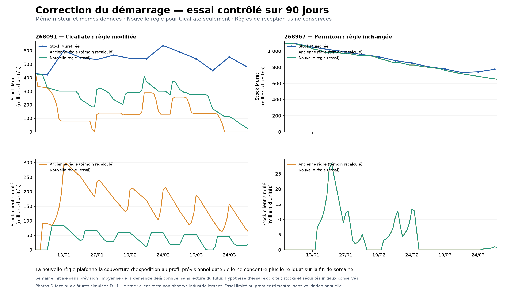

# Cicalfate : essai de correction du démarrage

Le 8 octobre 2026, deux simulations normales ont été recalculées du 1er janvier au 31 mars 2025 : le témoin C8R avec le moteur courant et une variante limitée aux expéditions de Cicalfate (268091) vers le client. La variante réduit les envois anticipés excessifs et rapproche les stocks de Muret des observations. Elle ajoute toutefois trois jours de retard client : elle reste un **essai non promu en référence nominale**.

## Résultats

| Cicalfate, premier trimestre | Témoin | Variante |
|---|---:|---:|
| Expédition depuis Muret le 1er janvier, UN | 96 052 | 5 700 |
| Expéditions cumulées au 12 janvier, UN | 349 852 | 129 165 |
| Stock Muret simulé comparable à la photo du 13 janvier, UN | 80 686 | 301 373 |
| Écart absolu moyen aux 13 photos de stock, UN | 398 311 | 286 322 |
| Jours avec stock Muret nul | 12 | 0 |
| Stock client simulé moyen, UN | 156 654 | 40 680 |
| Jours avec retard client en clôture | 2 | 5 |
| Retard cumulé, unités-jours | 5 700 | 67 530 |
| Retard à la fin des 90 jours, UN | 0 | 0 |

La photo réelle du 13 janvier est de **601 026 UN** : un écart important subsiste. L'erreur moyenne baisse de **28,12 %** et le stock client moyen de **74,03 %**. Les 911 754 unités demandées sur la période sont finalement servies dans les deux calculs ; cela inclut les rattrapages et ne signifie pas un service à l'heure de 100 %.

Permixon (268967) conserve exactement les mêmes trajectoires comparées. Le témoin reproduit les stocks Muret des 90 premiers jours du C8R historique sans écart. Les photos datées D sont rapprochées des clôtures simulées D−1 ; le point initial commun n'entre pas dans la moyenne des 13 écarts.

## Correction essayée

Le contrat optionnel `customer_dispatch_forecast_policy`, mode `dated_source_profile_v1`, est activé uniquement pour `(C-XXXXX, item:268091)` dans le graphe candidat. Sans activation, le comportement historique reste applicable.

Pour les expéditions physiques, la couverture des jours futurs utilise le profil quotidien de la prévision connue à la décision. Elle est plafonnée par le reliquat prévisionnel et ne concentre plus tout le reliquat hebdomadaire sur les derniers jours. La consommation prévisionnelle du MRP global reste identique.

Pour les premiers jours sans prévision couvrant la semaine initiale, la variante utilise la moyenne de la demande déjà observée à la date de décision. Cette hypothèse causale est explicitement tracée ; elle ne lit pas les demandes futures. Le 1er janvier, les 1 900 UN connues donnent 3 800 UN de couverture future sur deux jours, plus 1 900 UN de retard : 5 700 UN expédiées.

Les quantités physiques restent entières. Les stocks initiaux, les sécurités source en jours lundi–vendredi à 100 %, les règles de réception usine, les délais de transport et `tau_process` sont conservés. Cela ne signifie pas que tous les événements d'approvisionnement restent identiques après propagation du changement.

## Pourquoi trois jours supplémentaires de retard ?

La semaine du 10 au 16 mars a une prévision connue de **30 904 UN** (`Projection!A107:E107`, version du 24 février), contre **91 302 UN de demande réalisée**. Dès le 12 mars, les 39 129 UN déjà demandées épuisent le budget prévisionnel : le reliquat et la couverture future deviennent nuls. Le stock client descend à 1 693 UN le 13 mars. La règle attend alors l'apparition du retard pour envoyer à nouveau, avec deux jours de transport.

Les retards en clôture sont de 11 350 UN le 14 mars, 24 393 UN le 15 mars et 26 087 UN le 16 mars, puis sont rattrapés le 17 mars. Muret possède encore 265 234 UN le 14 mars après expédition : cette difficulté vient de l'anticipation des envois vers le client, pas d'une absence de produit à Muret. Le stock client excessif de l'ancienne règle masquait ce problème.

## Suite prioritaire et limites

1. Définir une couverture causale quand la demande dépasse la prévision : un budget prévisionnel épuisé ne prouve pas que la demande future est nulle. Comparer une nouvelle variante sur le service à l'heure, les stocks et les expéditions avant toute promotion.
2. Réconcilier le pipeline usine–Muret à l'ouverture : la première réception simulée reste le 26 janvier. Les engagements en transit initiaux et la signification industrielle du délai de libération restent à documenter ; aucun stock ou arrivage n'a été inventé.
3. Après résolution du service client, étendre le calcul à l'année. Ce premier trimestre ne certifie ni la calibration annuelle ni les pratiques industrielles d'expédition.

Le stock client est un compartiment simulé sans observation industrielle correspondante. Les mouvements Muret disponibles sont des mouvements nets hebdomadaires, pas un registre certifié de livraisons client brutes. Aucun retard simulé n'a été converti en chiffre d'affaires perdu.

## Preuves

Le [manifeste de livraison](../../artifacts/testing/cicalfate_correction_20261008/manifest.json) regroupe les simulations, tests ciblés, qualifications CSV, contre-vérification indépendante et leurs empreintes. Les [données comparées](../../artifacts/testing/cicalfate_correction_20261008/comparison_data.json), les [trajectoires CSV](trajectoires.csv) et les [photos rapprochées](photos_comparees.csv) permettent de relire les résultats.

Les tests sélectionnés ont été relus avant lancement : calculs en mémoire uniquement. Aucune suite globale, aucun test d'altération de fichiers ou de dates, aucun parcours navigateur n'a été exécuté pour cet essai. Les contrôles de conservation prouvent la cohérence des calculs couverts, pas leur calibration industrielle.
