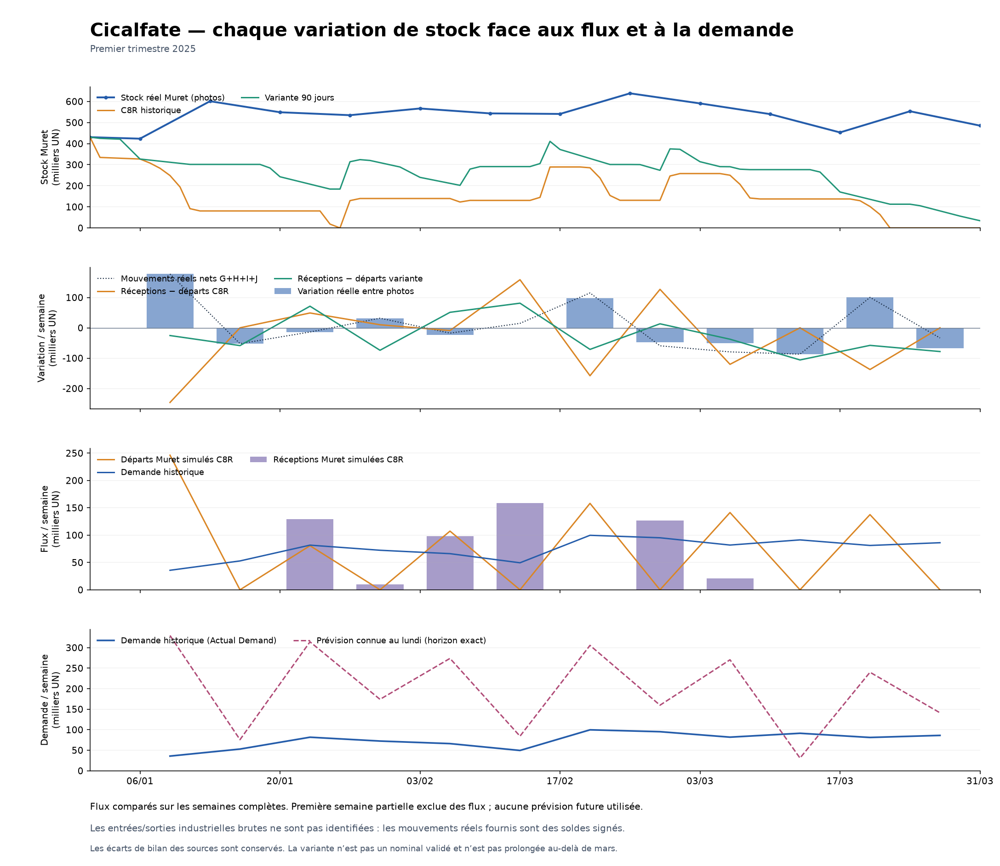
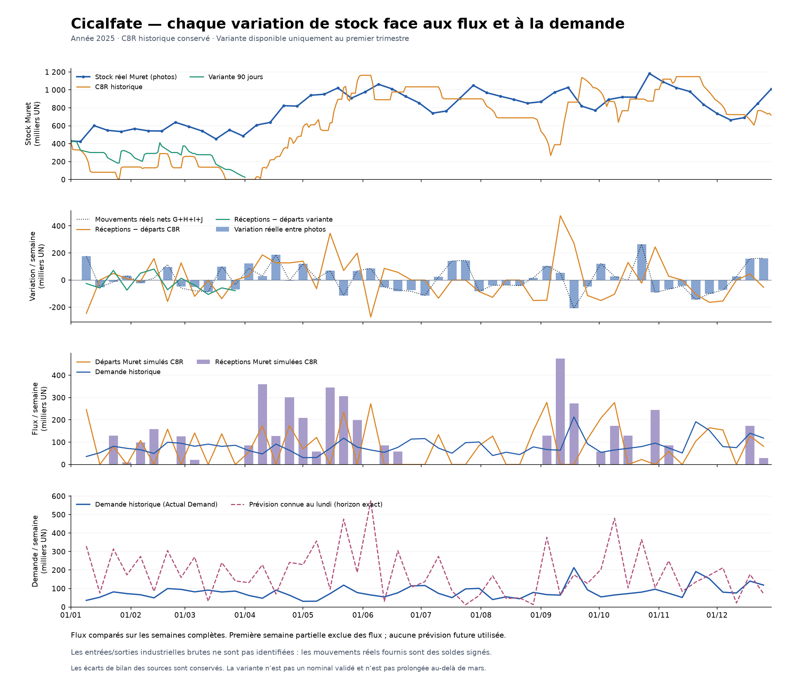

# Cicalfate : rapprochement de chaque variation réelle et simulée

Analyse du 8 octobre 2026, sans modification du moteur ni nouvelle simulation. Les 51 semaines complètes de 2025 sont comparées au C8R historique conservé ; les 12 premières sont aussi comparées à la variante de correction sur 90 jours. Permixon est fourni comme comparaison dans les mêmes exports.

**Le décalage de Cicalfate combine des expéditions anticipées excessives et un calendrier de réceptions usine–Muret incompatible avec plusieurs hausses de stock observées. La première correction ne résout pas ces deux mécanismes.** La prévision fournie est également très éloignée de la demande historique. Les données disponibles identifient exactement les écarts de variation, mais pas tous les flux industriels bruts qui les expliqueraient.

[Tableau complet consultable](comparaison.html) · [Toutes les valeurs et lignes sources en CSV](variations_hebdomadaires.csv) · [Manifeste des preuves](../../artifacts/testing/cicalfate_variations_20261008/manifest.json)

## Le démarrage : la correction a déplacé une partie des gros envois

Le stock initial de 430 538 UN est correct. La variante expédie 5 700 UN le 1er janvier, puis 1 900 UN les 2 et 3 janvier. Cependant, elle envoie **47 076 UN le 4 janvier et autant le 5 janvier** : elle anticipe les deux premiers jours de la semaine suivante, dont la prévision connue est de 329 532 UN, soit 47 076 UN/jour. La baisse de l'expédition du seul 1er janvier ne suffit donc pas à démontrer un démarrage réaliste.

Du 1er au 5 janvier, la variante expédie 103 652 UN et ne reçoit rien. Au 6 janvier, elle a 326 886 UN en stock, contre 423 434 observées : **96 548 UN d'écart sont déjà constituées**. Cette comparaison porte sur les photos du 1er et du 6 janvier. Le mouvement source de la semaine du 30 décembre couvre aussi deux jours de 2024 et n'est pas assimilé artificiellement à ces cinq jours.

La semaine du 6 au 12 janvier ajoute 203 105 UN d'écart : le stock réel gagne 177 592 UN, alors que la variante perd 25 513 UN. Au 13 janvier, l'écart atteint donc **299 653 UN**. Dans le C8R historique, cette même semaine expédie 246 200 UN sans réception : l'écart de variation est encore plus grand, à −423 792 UN.

## Chaque semaine du premier trimestre

Toutes les valeurs sont en UN. La variation réelle vient des deux photos de stock ; elle peut différer du mouvement net fourni. Les prévisions sont celles de la dernière version disponible **au lundi de la semaine**, pour cette semaine exacte. La variation simulée correspond ici à la variante sur 90 jours.

| Semaine du | Variation stock réel | Net mouvements réel | Demande historique | Prévision connue | Réceptions simulées | Départs simulés | Variation simulée |
|---|---:|---:|---:|---:|---:|---:|---:|
| 06/01 | +177 592 | +177 592 | 35 719 | 329 532 | 0 | 25 513 | −25 513 |
| 13/01 | −52 304 | −52 304 | 52 821 | 75 740 | 0 | 58 633 | −58 633 |
| 20/01 | −13 893 | −13 893 | 81 702 | 314 151 | 129 600 | 58 358 | +71 242 |
| 27/01 | +31 811 | +31 811 | 72 348 | 174 010 | 10 060 | 84 151 | −74 091 |
| 03/02 | −23 305 | −17 545 | 66 112 | 273 757 | 98 315 | 47 222 | +51 093 |
| 10/02 | −2 566 | +14 714 | 49 422 | 84 211 | 158 595 | 77 383 | +81 212 |
| 17/02 | +97 690 | +114 970 | 99 694 | 305 507 | 0 | 71 210 | −71 210 |
| 24/02 | −47 833 | −59 353 | 95 154 | 159 738 | 126 795 | 113 603 | +13 192 |
| 03/03 | −50 622 | −79 422 | 81 856 | 270 385 | 20 874 | 58 468 | −37 594 |
| 10/03 | −86 980 | −86 980 | 91 302 | 30 904 | 0 | 106 015 | −106 015 |
| 17/03 | +100 361 | +100 361 | 81 108 | 240 020 | 0 | 57 934 | −57 934 |
| 24/03 | −68 091 | −33 531 | 86 120 | 141 170 | 0 | 78 280 | −78 280 |

Les 11 arrivées physiques à Muret du premier trimestre ont les mêmes dates et quantités dans C8R et dans la variante : **544 239 UN au total**. L'essai a changé les expéditions client, pas ce calendrier d'arrivées. Sur les 12 semaines ci-dessus, **8 variations simulées ont le sens opposé à la variation réelle**.

Lecture de quelques semaines :

- **6 janvier : approvisionnement initial manquant ou trop tardif dans le modèle.** La hausse réelle est attestée par le stock et les mouvements. La simulation n'a aucune réception. Les sources ne permettent pas d'identifier le camion ou l'OF industriel correspondant.
- **13 janvier : variation proche, niveau encore faux.** La variante baisse de 58 633 UN contre 52 304 UN dans le réel : seulement 6 329 UN d'écart supplémentaire. Le gros écart de stock est hérité des semaines précédentes.
- **20 et 27 janvier : arrivées et départs mal synchronisés.** La variante gagne 71 242 UN lorsque le réel en perd 13 893, puis perd 74 091 UN lorsque le réel en gagne 31 811. Une réception le 26 janvier ne répare pas rétroactivement la hausse réelle observée au 13 janvier.
- **17 février et 17 mars : nouvelles hausses réelles sans arrivée simulée.** La variante continue de vider Muret. Le problème n'est donc pas limité à l'ouverture du 1er janvier.
- **10 mars : prévision trop basse.** La prévision de 30 904 UN est dépassée par 91 302 UN de demande. Son épuisement provoque trois jours supplémentaires de retard dans la variante. Les expéditions de fin de semaine servent aussi à anticiper la semaine suivante ; elles ne représentent pas les seules livraisons de la demande de cette semaine.

## Ce que dit la prévision face à la demande historique

Sur les **51 semaines complètes du 6 janvier au 28 décembre** :

| Référence | Demande historique | Somme des prévisions connues par semaine | Ratio prévision / historique |
|---|---:|---:|---:|
| Cicalfate 268091 | 4 145 843 | 9 404 597 | 2,27 |
| Permixon 268967 | 1 691 923 | 2 965 870 | 1,75 |

Ces totaux prennent une seule prévision par semaine, sans additionner les versions successives d'une même semaine. Pour Cicalfate, la somme des erreurs absolues prévision–historique vaut 6 275 344 UN, soit 151,36 % de la demande cumulée. Les erreurs changent de sens : une surestimation globale n'empêche pas une sous-estimation brutale comme en mars.

La lecture de la demande et des prévisions en UN suit la convention des produits finis et des stocks/mouvements ZUN ; les onglets de demande ne déclarent pas eux-mêmes une colonne d'unité.

La demande historique est disponible dans `Historique / Actual Demand` et elle est identique à la demande exécutée comme entrée de simulation sur toutes les semaines complètes. **L'écart de stock ne vient donc pas d'une autre quantité de demande historique injectée dans la simulation.** Il vient des décisions d'expédition, des réceptions et des autres conventions du modèle. La prévision influence ces décisions mais n'est pas expédiée intégralement comme un volume annuel : C8R expédie 4 061 933 UN sur ces 51 semaines, pas 9,40 millions.

## Sur l'année : le calendrier des flux reste un problème majeur

Pour Cicalfate, **23 des 51 variations hebdomadaires C8R vont dans le sens opposé au réel**. Dans 10 semaines, les mouvements réels sont nets positifs alors que la simulation n'a aucune réception : 6 janvier, 17 février, 17 mars, 2 juin, 7 juillet, 14 juillet, 21 juillet, 25 août, 20 octobre et 8 décembre.

Les plus grands écarts de variation ne sont pas tous en janvier : semaine du 15 septembre, baisse réelle de 208 372 UN face à une hausse simulée de 273 600 UN ; semaine du 8 septembre, hausse réelle de 54 852 UN face à 475 200 UN simulées ; semaine du 2 juin, hausse réelle de 86 835 UN face à une baisse simulée de 272 383 UN.

Le [détail de la chaîne usine–Muret](../../artifacts/testing/cicalfate_variations_20261008/supply_analysis.json) sépare les événements effectivement simulés des hypothèses industrielles. La première réception est issue d'un conditionnement du 10 janvier, libéré le 24 janvier après le délai actuellement paramétré, puis reçu à Muret les 26 et 27 janvier. Cela établit le mécanisme simulé ; cela ne démontre pas que cette immobilisation reproduit la réalité. Les sécurités source et `tau_process` n'ont pas été modifiés.

C8R ne reçoit ensuite aucun PF à Muret pendant **75 jours, du 23 juin au 5 septembre**. Les traces présentent notamment 58 jours sans proposition usine due, du 23 juin au 19 août. Il serait incorrect d'attribuer tout ce trou à une pénurie matière ou à la fermeture d'août : les événements disponibles ne le démontrent pas. Le calendrier des besoins et des lancements doit être examiné pour expliquer cette absence d'approvisionnement alors que plusieurs hausses nettes réelles interviennent en juillet.

Le fractionnement de la première arrivée, **129 600 + 10 060 UN**, est expliqué par une règle simulée de départ par multiples de **14 400 UN**, puis par l'autorisation d'expédier le reliquat inférieur à ce multiple lors de la revue suivante. Le [registre des hypothèses C8R](../../artifacts/testing/mrp_packaging_solutions_20261006/run_C8R_365/data/assumptions_ledger.csv) l'identifie comme `internal_physical_dispatch`. La revue effective est quotidienne. Le mode de transport est nommé « truck », mais ni une capacité de camion ni une fréquence industrielle hebdomadaire ne sont établies par ces éléments.

## Limites des mouvements d'inventaire fournis

Pour les 53 lignes Cicalfate du site 1920, H « Entrées » et J valent zéro, tandis que I « Sorties » comporte 25 valeurs positives et 28 négatives. On ne peut donc pas lire H comme toutes les réceptions physiques et I comme des départs bruts. Le total signé G+H+I+J est utilisé comme mouvement net, sans lui attribuer un flux industriel absent des sources.

Parmi les 51 semaines comparables de Cicalfate, **38 bilans ferment exactement et 13 présentent un écart**, jusqu'à 34 560 UN en valeur absolue. Ces écarts se compensent sur l'année, mais restent significatifs semaine par semaine. Le CSV conserve G, H, I, J, les photos de borne, les numéros de lignes et le résidu. Ils ne sont pas corrigés silencieusement ni imputés à un fournisseur.

Pour expliciter les écarts, le CSV contient aussi l'identité :

`écart de variation = [réceptions simulées − (net réel + demande)] − [départs simulés − demande] + résidu source`

Le terme `net réel + demande` est un **solde conditionnel** : il ne serait interprétable comme entrée d'équilibrage que sous l'hypothèse que les départs réels égalent la demande. Cette hypothèse n'est pas prouvée. Ce terme n'est jamais présenté comme une réception réellement observée.

## Priorités issues de ce rapprochement

1. Réconcilier le pipeline initial et les hausses nettes réelles sans réception simulée, en commençant par la semaine du 6 janvier. Rechercher les engagements/OF/transits correspondants dans les sources existantes et documenter les informations réellement manquantes.
2. Revoir l'utilisation de la prévision pour les départs client : la variante anticipe encore 94 152 UN les 4–5 janvier et gère mal le dépassement de prévision en mars. Évaluer ensemble ponctualité, stock client, stock Muret et engagements en transit.
3. Examiner les décalages de dates dans les 13 bilans source non fermés avant de calibrer des réceptions hebdomadaires à partir de ces lignes.
4. Valider une nouvelle règle sur plusieurs périodes de 2025 ; ne pas déclarer une correction réussie sur le seul stock moyen ou sur une seule expédition initiale.

Les contrôles de cette passe portent sur l'analyse en lecture seule, les bilans, l'alignement des semaines, les versions prévisionnelles et les empreintes. Les qualifications des simulations précédentes restent des preuves historiques liées à leurs propres manifestes ; elles ne sont pas revendiquées comme de nouvelles exécutions. Aucun test d'altération de fichier, aucune suite globale et aucun contrôle navigateur n'ont été exécutés ici.

La contre-vérification indépendante finale compte **32 501 contrôles réussis**, dont le rapprochement direct aux Excel et aux CSV simulés. Un premier contrôle a été refusé sur quatre occurrences d'un libellé : le diagnostic décrivait le signe du mouvement net, tandis que l'oracle attendait celui de la variation des photos. Ces deux signes diffèrent la semaine du 10 février à cause du résidu source. L'attendu textuel a été explicité ; aucun chiffre ni seuil n'a été changé. La première preuve refusée est conservée avec la preuve finale. Le doctor et son gate vérifient l'environnement et ses empreintes ; ils ne certifient pas les résultats industriels.
