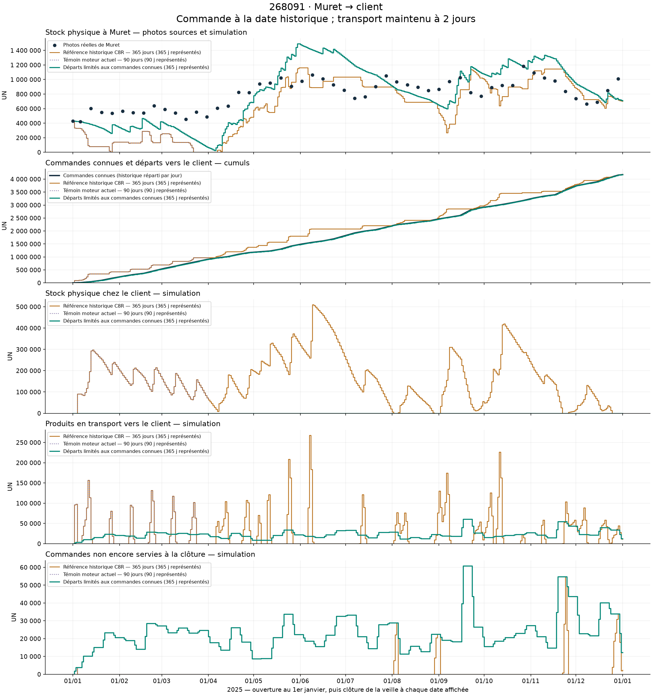
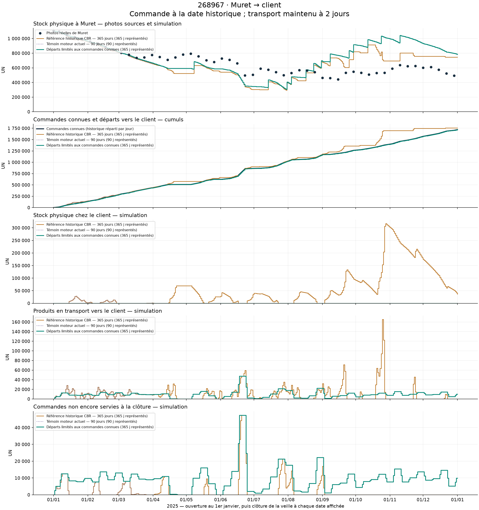

# Départs clients limités aux commandes connues

Essai : l’historique hebdomadaire est réparti en commandes quotidiennes entières. La date de commande est supposée égale à cette date historique ; ce n’est pas un historique industriel des prises de commande. Les prévisions servent à planifier, sans autoriser un départ physique non commandé.

Le transport Muret → client reste de **2 jours**. Les commandes en attente incluent donc celles déjà en transport. Elles ne sont ni effacées ni assimilées à un manque de stock à Muret. Aucun stock client ou transit industriel observé n’est fourni.

Les photos sont rapprochées de la **clôture de la veille**. Le 1er janvier représente l’ouverture, exclue des erreurs moyennes. Le témoin à 90 jours s’arrête au 31 mars et n’est pas extrapolé à l’année.

| Calcul | Période représentée |
|---|---|
| Référence historique C8R — 365 jours | 01/01/2025–31/12/2025 (365 jours) |
| Témoin moteur actuel — 90 jours | 01/01/2025–31/03/2025 (90 jours) |
| Départs limités aux commandes connues | 01/01/2025–31/12/2025 (365 jours) |

## 268091

| Calcul | Commandes | Départs | Servies | En attente à la fin | Jours avec attente | Stock client final | Transit final |
|---|---:|---:|---:|---:|---:|---:|---:|
| Référence historique C8R — 365 jours (365 j) | 4 173 776 | 4 182 482 | 4 171 388 | 2 388 | 21 | 0 | 11 094 |
| Témoin moteur actuel — 90 jours (90 j) | 911 754 | 974 777 | 911 754 | 0 | 2 | 63 023 | 0 |
| Départs limités aux commandes connues (365 j) | 4 173 776 | 4 173 776 | 4 161 487 | 12 289 | 365 | 0 | 12 289 |

| Calcul | Photos | Nombre | Erreur absolue moyenne stock | Biais moyen |
|---|---|---:|---:|---:|
| Référence historique C8R — 365 jours | 2025-01-06–2025-12-29 | 52 | 254 470 UN | -166 392 UN |
| Référence historique C8R — 365 jours | 2025-01-06–2025-03-31 | 13 | 398 311 UN | -398 311 UN |
| Témoin moteur actuel — 90 jours | 2025-01-06–2025-03-31 | 13 | 398 311 UN | -398 311 UN |
| Témoin moteur actuel — 90 jours | 2025-01-06–2025-03-31 | 13 | 398 311 UN | -398 311 UN |
| Départs limités aux commandes connues | 2025-01-06–2025-12-29 | 52 | 240 023 UN | 25 281 UN |
| Départs limités aux commandes connues | 2025-01-06–2025-03-31 | 13 | 217 048 UN | -217 048 UN |

| Photo | Calcul | Stock réel | Stock simulé | Écart |
|---|---|---:|---:|---:|
| 2025-01-01 | Référence historique C8R — 365 jours | 430 538 | 430 538 | 0 |
| 2025-01-06 | Référence historique C8R — 365 jours | 423 434 | 326 886 | -96 548 |
| 2025-01-13 | Référence historique C8R — 365 jours | 601 026 | 80 686 | -520 340 |
| 2025-01-01 | Témoin moteur actuel — 90 jours | 430 538 | 430 538 | 0 |
| 2025-01-06 | Témoin moteur actuel — 90 jours | 423 434 | 326 886 | -96 548 |
| 2025-01-13 | Témoin moteur actuel — 90 jours | 601 026 | 80 686 | -520 340 |
| 2025-01-01 | Départs limités aux commandes connues | 430 538 | 430 538 | 0 |
| 2025-01-06 | Départs limités aux commandes connues | 423 434 | 421 038 | -2 396 |
| 2025-01-13 | Départs limités aux commandes connues | 601 026 | 385 319 | -215 707 |

## 268967

| Calcul | Commandes | Départs | Servies | En attente à la fin | Jours avec attente | Stock client final | Transit final |
|---|---:|---:|---:|---:|---:|---:|---:|
| Référence historique C8R — 365 jours (365 j) | 1 719 549 | 1 756 306 | 1 719 549 | 0 | 93 | 36 757 | 0 |
| Témoin moteur actuel — 90 jours (90 j) | 440 233 | 449 468 | 440 233 | 0 | 47 | 831 | 8 404 |
| Départs limités aux commandes connues (365 j) | 1 719 549 | 1 719 549 | 1 709 675 | 9 874 | 346 | 0 | 9 874 |

| Calcul | Photos | Nombre | Erreur absolue moyenne stock | Biais moyen |
|---|---|---:|---:|---:|
| Référence historique C8R — 365 jours | 2025-01-06–2025-12-29 | 52 | 145 076 UN | 5 731 UN |
| Référence historique C8R — 365 jours | 2025-01-06–2025-03-31 | 13 | 28 589 UN | -28 589 UN |
| Témoin moteur actuel — 90 jours | 2025-01-06–2025-03-31 | 13 | 28 589 UN | -28 589 UN |
| Témoin moteur actuel — 90 jours | 2025-01-06–2025-03-31 | 13 | 28 589 UN | -28 589 UN |
| Départs limités aux commandes connues | 2025-01-06–2025-12-29 | 52 | 177 434 UN | 68 780 UN |
| Départs limités aux commandes connues | 2025-01-06–2025-03-31 | 13 | 15 568 UN | -15 568 UN |

| Photo | Calcul | Stock réel | Stock simulé | Écart |
|---|---|---:|---:|---:|
| 2025-01-01 | Référence historique C8R — 365 jours | 1 101 534 | 1 101 534 | 0 |
| 2025-01-06 | Référence historique C8R — 365 jours | 1 092 542 | 1 087 279 | -5 263 |
| 2025-01-13 | Référence historique C8R — 365 jours | 1 048 744 | 1 028 965 | -19 779 |
| 2025-01-01 | Témoin moteur actuel — 90 jours | 1 101 534 | 1 101 534 | 0 |
| 2025-01-06 | Témoin moteur actuel — 90 jours | 1 092 542 | 1 087 279 | -5 263 |
| 2025-01-13 | Témoin moteur actuel — 90 jours | 1 048 744 | 1 028 965 | -19 779 |
| 2025-01-01 | Départs limités aux commandes connues | 1 101 534 | 1 101 534 | 0 |
| 2025-01-06 | Départs limités aux commandes connues | 1 092 542 | 1 088 719 | -3 823 |
| 2025-01-13 | Départs limités aux commandes connues | 1 048 744 | 1 044 922 | -3 822 |

## Contrôles et limites

**Réserve de reproduction : le contrôle strict face à C8R reste en échec.** Un écart préexistant de 1 UN au maximum concerne 338929 à Avène sur 42 jours entre J46 et J89. Les deux produits finis comparés ici sont identiques sur les 90 jours. Les sept CSV du témoin courant sont identiques à ceux du précédent témoin `cicalfate_correction_20261008/run_control_90`. Voir [contrôle strict — échec conservé](../../artifacts/testing/customer_orders_only_20261008/validation/control_prefix.json) et [caractérisation de l’écart préexistant](../../artifacts/testing/customer_orders_only_20261008/validation/control_differences.json). Aucun écart n’a été masqué ou arrondi pour passer le contrôle.

Les CSV ont été rapprochés sans importer le moteur : demande identique aux références sur les jours communs, quantités physiques UN entières, conservation des expéditions, transit de 2 jours, bilan client et bilan Muret, service et retard. Pour le candidat, les départs cumulés ne dépassent jamais les commandes connues cumulées.

Ces vérifications établissent la cohérence de l’essai, pas sa calibration industrielle. Une amélioration du stock à Muret ne prouve pas que la politique de fabrication ou la date de prise de commande est correcte.

Détails : [quotidien.csv](quotidien.csv), [photos.csv](photos.csv), [metriques.csv](metriques.csv), [manifest.json](manifest.json). Les sources réelles sont identifiées par leurs empreintes dans ce dernier fichier.
